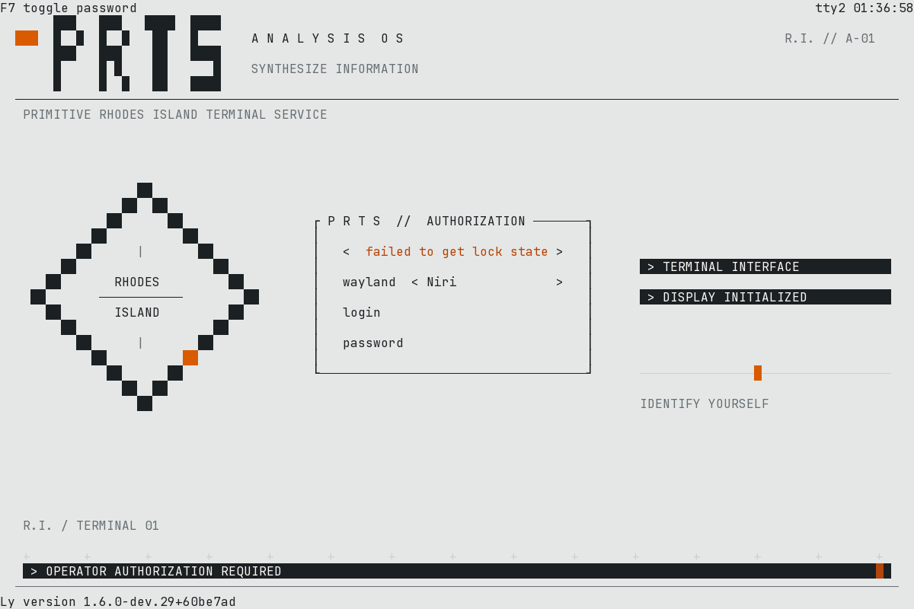

# PRTS / Analysis OS — Ly 登录主题

白色 Analysis OS 风格：浅灰白底、黑色几何结构、橙色强调。PRTS 字标、
菱形 Rhodes Island 徽记和命令条依次入场，随后进入缓慢扫描与呼吸高亮。
入场不阻塞登录；动画始终避开 Ly 的原生表单及屏幕边缘快捷键。



[启动与待机动图](docs/previews/entrance.gif) · [终端录制](docs/previews/120x40.cast) ·
[80×24](docs/previews/80x24.png) · [40×15](docs/previews/40x15.png)

图片和 GIF 来自实际 `ly-dm` 输出，经终端解析器回放渲染，并非设计稿或桌面截屏。
PTY 中的 `failed to get lock state` 提示保留原样；它与动画加载无关。

## 预览与安装

需要支持 Lua 动画的 Ly、Python 3、Bash；测试和安装预检还需要 `luajit`。
本项目实测版本：`1.6.0-dev.29+60be7ad`。

```sh
./tools/debug_sandbox.sh --check
./tools/debug_sandbox.sh              # 在终端内运行，Ctrl+C 退出
```

预览自动编译模块，并在 `/tmp/prts-ly-preview/run.*` 创建独立配置。
可通过 `SANDBOX` 指定父目录；脚本不会删除已有目录。
预览禁用电源快捷键、自动登录、启动脚本、登录信息保存，并使用独立 PAM 服务名。
这是布局检查环境，请勿在其中尝试实际认证。

确认效果后安装：

```sh
sudo ./tools/install.sh               # 安装到 /etc/ly
./tools/install.sh /tmp/prts-install  # 或指定可写的独立配置目录
```

安装器先构建、校验配置并执行动画预检；存在目标目录时先完整备份，
再复制构建产物。备份路径会输出到终端。安装器不重启服务。
直接复制 `src` 不能运行：源码中的模块需要先打包。

## 字体

Ly 没有字体选项：内核控制台只能用 `/etc/vconsole.conf` 的点阵字体，
想要接近预览图的 TrueType 观感需切换到 KMSCON VT。

```sh
sudo ./tools/kmscon.sh status     # 查看当前状态
sudo ./tools/kmscon.sh trial      # 在 tty3 试跑，不动正在使用的 tty
sudo ./tools/kmscon.sh enable     # 正式切到 tty1 的 KMSCON
sudo ./tools/kmscon.sh disable    # 回滚到内核控制台
```

字体与字号在 `/etc/kmscon/kmscon.conf` 配置。原理、已知问题和回滚见
[字体与 KMSCON](docs/kmscon.md)。

## 修改与扩展

`src/animation/anime.lua` 是简短的入口，组件使用普通 Lua 模块写法。
`theme/color.lua` 管理配色，`theme/options.lua` 控制入场与减少动效；
`core` 负责时间、布局和绘制，`components` 负责徽记和面板。

```lua
-- theme/options.lua
return {
    entrance = true,        -- false：立即进入待机
    reduced_motion = false, -- true：直接显示静态完整画面
}
```

Ly 没有打开 `package` 库，因此不能依赖系统 `require`。
打包器将模块嵌入工厂函数，提供局部 `require` 与缓存；运行时不读取文件，
不需要 `io`、`package`、`loadfile` 或额外进程。

```sh
python3 tools/build.py                # 输出 build/config.lua 和单文件动画
python3 tools/test_build.py
luajit tools/test_animation.lua build/animation/anime.lua
```

新增组件示例：

```lua
-- src/animation/components/example.lua
local M = {}
function M.draw(ctx, bounds, time, colors)
    if bounds.mode == "full" and time.ready then
        ctx:text(bounds.right, 8, "EXAMPLE / READY", colors.muted)
    end
end
return M
```

将 `components.example` 添加到 `src/animation/modules.txt`，在入口中
`local example = require("components.example")`，然后在 `draw()` 内调用
`example.draw(ctx, bounds, time, C)`。重新执行预览即可；不编辑构建产物。
绘制必须经过 `ctx`，由它保证坐标有效和登录框避让。
文本使用 ASCII，几何符号通过 `ctx:cell` 传 Unicode 码点。
配色修改若涉及 Ly 原生表单，也要同步 `src/config.lua`。

更多设计、动画和运维说明：

- [图标设计](docs/icon-design.md)
- [动画扩展指南](docs/animation-guide.md)
- [PRTS 终端功能](docs/operations.md)
- [故障排查](docs/troubleshooting.md)

## 录制与验证

详细记录见 [验证说明](docs/validation.md)。录制工具额外需要 `pyte==0.8.2`、
Pillow 和 `fc-match`，这些不是主题运行依赖。

```sh
python3 -m venv --system-site-packages /tmp/prts-capture-env
/tmp/prts-capture-env/bin/pip install pyte==0.8.2 Pillow
/tmp/prts-capture-env/bin/python tools/capture_preview.py \
  --size 120x40 --gif --output build/capture
asciinema play build/capture/preview.cast
```

录制包含 2.4 秒入场和后续待机。`--resize 60x20` 可在录制中途缩放，
不要与 `--gif` 同用。截图字体由 `fc-match monospace` 决定。
也可在交互终端使用 `script --log-out OUTPUT --log-timing TIMING` 录制，
再执行 `scriptreplay --log-out OUTPUT --log-timing TIMING` 回放。

布局在 100×30 及以上显示完整构图，80×24 显示简化徽记，小于该尺寸时
优先保留表单。40×15 是当前配置实测的最小完整表单尺寸；更小尺寸只保证
动画不越界，Ly 自身表单可能被裁切。

## 设计参考

- [官方 Doctor’s Notes](https://x.com/ArknightsEN/status/1854780899780616656)：浅色终端、黑色命令条、橙色强调、菱形徽记。
- [Mashiro 的 Arknights UI 复刻](https://github.com/mashirozx/arknights-ui)：面板层级和信息排版。
- [PRTS Plymouth](https://github.com/LS-KR/prts-plymouth)：PRTS 启动动画的参考项目。

本项目使用自行绘制的字符几何，不包含上述项目的图片或动画帧。
主题为非官方同人作品。Ly 的动画接口只有尺寸、时钟和绘图能力，
不提供认证事件；状态文案不会伪装为密码验证结果或真实系统遥测。
